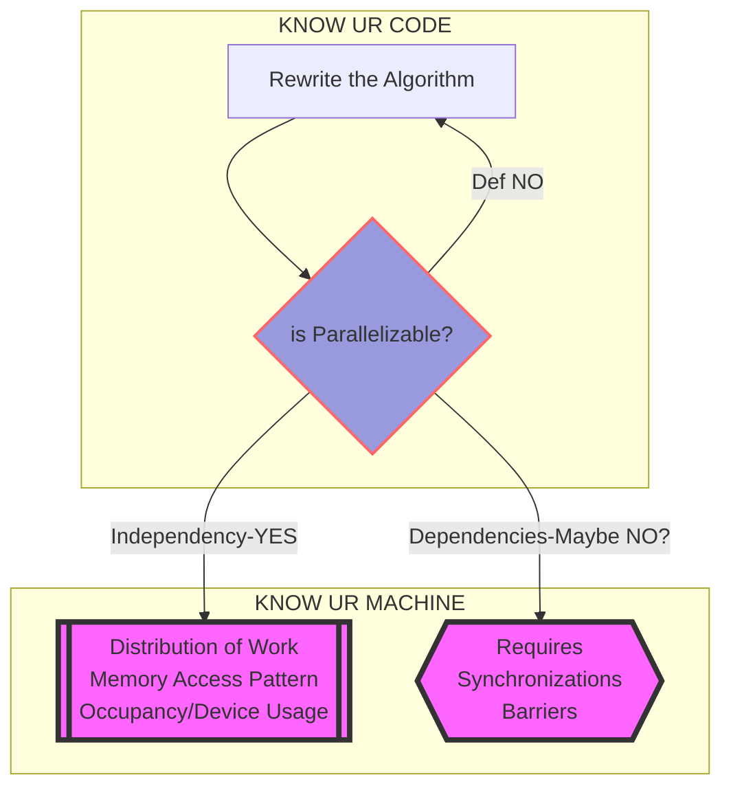

# Parallelizing 2D Fast-Fourier Transform Implemented with Cooley-Tukey Algorithm Using CUDA

## Decision Making in Parallelizing an Algorithm

## File Structure
**Each folder has (and will have) its respective `README` describing what type of modules should be placed inside**

**Make sure you have the following folders**
- Data Files should be placed in `./FFT/Data/` 
- Output results by methods from `/FFT/eval/` will be output to `/FFT/Data/Results/`
- `test_cuda.sh` will output buffered printouts in `FFT/Data/Oscar/`

## Prerequisite
- [FFTW C/C++ library](https://www.fftw.org/) for validating the results (not necessary)
    - `MacOS` installation: `brew install fftw`
- Most likely a 'Turing Arch' GPU with `CUDA11.2.0` 

## Compile with `FFTW` library
*Change the `FFTW` library path as needed*

### Compilation with Makefile (recommended)
In the `./FFT/` folder use the bash command `make`

**May need to change `NVCCFLAG` for GPUs with different Compute Capabilities (CC), but no CC-specific CUDA API calls in current implementation**

*If a fresh build is desired, simply run `make clean` before running `make` or `make all`*

## Run 
`./It_CT.out`

or `nsys profile ./It_CT.out` to profile with NVIDIA NSIGHT and run

## Major Challenges
### 1D FFT
- Precision Concerns: Manipulation of Complex numbers; Cooley-Tukey method has runtime $O(N \log N)$, meaning the (primarily truncation) errors will build up at least proportional to this quantity
- Memory Management on `DEVICE` for FFT on Longer Vectors: currently using shared memory for data exchange between threads, but the memory size scales with problem size $N$ for this implementation (Limitation on Shared Memory size for each BLOCK/SM is Compute-Capability(CC) specific; GPU arch prior to `Volta` with CC 7.0 is limited to 48KB per BLOCK/SM, while `Double Precision Complex` takes 16 Bytes); primarily two options:
    - A Combination of Shared Mermoy and Warp-Level Primitives: requires a sophisticated design because a changing number of threads are dynamically assigned for each sub-vector in each outer for loop iteration
    - Stream-Lining the Outer for Loop in the Current Implementation of C-T Algorithm: Sequential Kernel Calls instead of just one  
    - Breaking Down/Down-Sampling the long vector to smaller subvectors; difficulties involving **Fourier Theories**
        - Frequency Leakage
        - Gibbs Effects
        - Aliasing (Nyquist Sampling Theorem)
- Plausibility of Nested Kernel Calls??

### 2D FFT
A couple implementation details to consider
- For effective data exchanges among a 2D thread BLOCK, may need to implement 2D FFT from scratch without sequential subKernel Calls
- Alternatively, offload row-wise 1D FFT calls to CUDA Streams before writing to the global memory for later column-wise 1D FFTs
- Or utilize 1D Batch FFT

### Performance Evaluation Workflow for CUDA Methods
- As `cudaMalloc` and `cudaFree` take up **RIDICULOUS** amount of time compared to kernels, for larger datasets, consider processing data as a batch.
    - Larger in Vector/Matrix Sizes
    - Larger in the Number of Samples

## TO-DOS
### 1D FFT
- Implement `eval_correctness` and `eval_performance` methods for CUDA
- Optimization for long vector FFT
- 1D FFT for batch input
    - Sequentially launch the kernels
    - Using thread blocks to process the input in batches(Tiling)
    - Streams with asynchronous operations
- Handle Batched input
    - Adjust the kernel to be able to handle batched 1D input
    - Create streams (large overhead) 

### 2D FFT
- ?? Design Kernels for 2D FFT (Nested Calls?)
- ?? Directly Optimize 2D FFT after `bitReverse` step
- Launch 1D FFT for batch input twice
- Kernel Launching method
- Correctness and Performance

### Misc
- ~`cudaCheck()`~
- ~Separate CUDA Utilities~
- Add data processing and memory allocation utils for CUDA
- Implement testing subroutines for CUDA method (`cudaMalloc` and `cudaFree` waste alot of time between kernel calls)

### Primary Files to Work On
- `CooleyTukeyFFT/*.cu`
- `eval/eval_correctness.cu`
- `eval/eval_performance.cu`
- Corresponding Headers
- ~Makefile~
- ~`SLURM` script~
