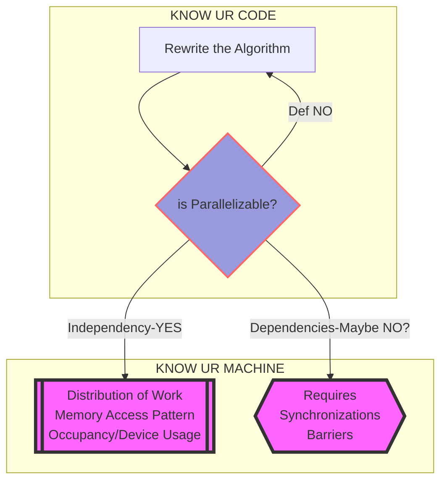

# Parallelizing 2D Fast-Fourier Transform Implemented with Cooley-Tukey Algorithm
The `main` branch keeps the non-optimized version of code. For optimized versions with different methods, just switch to respective branches by `git checkout <the branch>`

## Decision Making in Parallelizing an Algorithm

## File Structure
**Each folder has (and will have) its respective `readme` describing what type of modules should be placed inside**

**Make sure you have the following folders**
- Data Files should be placed in `./FFT/Data/` 
- Output results by methods from `/FFT/eval/` will be output to `/FFT/Data/Results`

## Prerequisite
- [FFTW C/C++ library](https://www.fftw.org/) for validating the results (not necessary)
    - `MacOS` installation: `brew install fftw`

## Compile with `FFTW` library
*Change the `FFTW` library path as needed*

## Manual Compilation
Navigate to `./FFT/` Folder then run the following bash command

~`g++-13 ./data_loader/loader.cpp main.cpp -o It_CT.o -I/usr/local/Cellar/fftw/3.3.10_1/include -L/usr/local/Cellar/fftw/3.3.10_1/lib -lfftw3`~

### Compilation with Makefile (recommended)
In the `./FFT/` folder use the bash command `make`

*If a fresh build is desired, simply run `make clean` before running `make` or `make all`*

## Run 
`./It_CT.out`

## TO-DOS
### 1D FFT
- Consider larger dataset

### 2D FFT
- Consider larger dataset

### `OpenMP` v.s. `MPI` v.s. `CUDA`
- Keep Codes in Separate Branches
- `makefile` for each
    - ~OpenMP~
    - MPI
    - ~CUDA~
- `SLURM` script for each
    - OpenMP
    - MPI
    - ~CUDA~

### Progress Table
||OpenMP | MPI | CUDA|
|:--:|:---:|:---:|:---:|
|1D FFT|:heavy_check_mark:|Not Considering| :white_check_mark:|
|2D FFT|:heavy_check_mark:|:x:|:x:|
|Performance Eval Subroutines|:heavy_check_mark:|:heavy_check_mark:|:x:|
