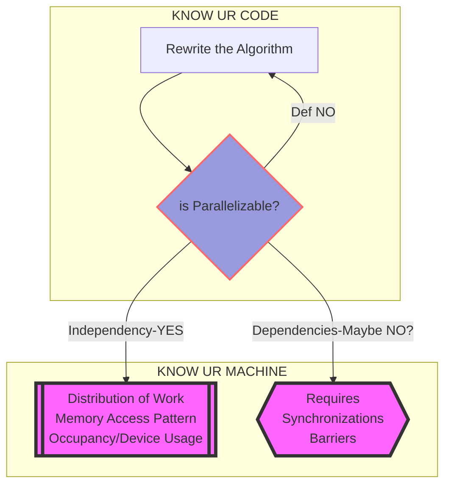

# Parallelizing 2D Fast-Fourier Transform Implemented with Cooley-Tukey Algorithm Using CUDA

## Decision Making in Parallelizing an Algorithm

## File Structure
**Each folder has (and will have) its respective `README` describing what type of modules should be placed inside**

**Make sure you have the following folders**
- Data Files should be placed in `./FFT/Data/` 
- Output results by methods from `/FFT/eval/` will be output to `/FFT/Data/Results/`
- `test_cuda.sh` will output buffered printouts in `FFT/Data/Oscar/`

## Prerequisite
- [FFTW C/C++ library](https://www.fftw.org/) for validating the results (not necessary)
    - `MacOS` installation: `brew install fftw`
- Most likely a 'Turing Arch' GPU with `CUDA11.2.0` 

## Compile with `FFTW` library
*Change the `FFTW` library path as needed*

### Compilation with Makefile (recommended)
In the `./FFT/` folder use the bash command `make`

**May need to change `NVCCFLAG` for GPUs with different Compute Capabilities (CC), but no CC-specific CUDA API calls in current implementation**

*If a fresh build is desired, simply run `make clean` before running `make` or `make all`*

## Run 
`./It_CT.out`

or `nsys profile ./It_CT.out` to profile with NVIDIA NSIGHT and run

## TO-DOS
### 1D FFT
- ~Design Kernels For 1D FFT~
- ~Implement Kernel Launching Method for 1D FFT~
- ~Validate Correctness~
- Implement `eval_correctness` and `eval_performance` methods for CUDA
- Optimization for long vector FFT

### 2D FFT
- ?? Design Kernels for 2D FFT (Nested Calls?)
- ?? Directly Optimize 2D FFT after `bitReverse` step
- Kernel Launching method
- Correctness and Performance

### Misc
- `cudaCheck()`
- Separate CUDA Utilities
- Add data processing and memory allocation utils for CUDA
- Implement testing subroutines for CUDA method (`cudaMalloc` and `cudaFree` waste alot of time between kernel calls)

### Primary Files to Work On
- `CooleyTukeyFFT/*.cu`
- `eval/eval_correctness.cu`
- `eval/eval_performance.cu`
- Corresponding Headers
- ~Makefile~
- ~`SLURM` script~
